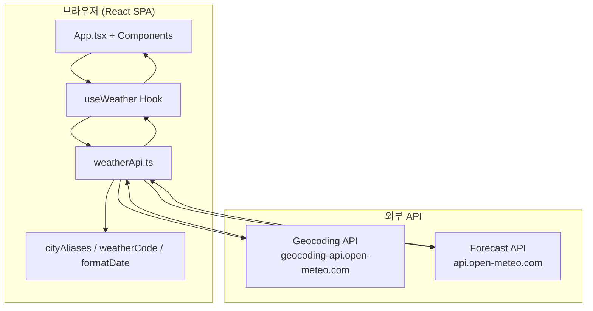

# Weekly Weather App

Open-Meteo API를 활용하여 사용자가 입력한 도시의 **7일간 일별 날씨 예보**를 조회·표시하는 React 기반 SPA(Single Page Application)입니다.

본 프로젝트는 바이브 코딩(Vibe Coding) 실습용으로 설계되었으며, **REST API 연동**, **비동기 데이터 처리**, **React 상태 관리**, **컴포넌트 분리**, **에러·로딩 UI 처리**, **반응형 레이아웃**, **배포 파이프라인**을 한 번에 경험할 수 있도록 구성되어 있습니다.

- **라이브 데모**: https://day3-react-vite-vibe-coding.vercel.app
- **저장소**: https://github.com/jjsnoel/day3-react-vite-vibe-coding
- **Vercel 대시보드**: https://vercel.com/jeongjaeseung-s-projects/day3-react-vite-vibe-coding
- **API 제공**: [Open-Meteo](https://open-meteo.com/) (API Key 불필요)

---

## 목차

1. [핵심 기능](#1-핵심-기능)
2. [기술 스택](#2-기술-스택)
3. [시스템 아키텍처](#3-시스템-아키텍처)
4. [프로젝트 구조](#4-프로젝트-구조)
5. [데이터 흐름](#5-데이터-흐름)
6. [API 명세](#6-api-명세)
7. [타입 정의](#7-타입-정의)
8. [모듈별 상세 설명](#8-모듈별-상세-설명)
9. [상태 관리](#9-상태-관리)
10. [예외 처리 정책](#10-예외-처리-정책)
11. [한글 도시명 검색 (별칭 맵)](#11-한글-도시명-검색-별칭-맵)
12. [날씨 코드 매핑](#12-날씨-코드-매핑)
13. [UI 및 반응형 레이아웃](#13-ui-및-반응형-레이아웃)
14. [로컬 개발 환경 설정](#14-로컬-개발-환경-설정)
15. [npm 스크립트](#15-npm-스크립트)
16. [빌드 및 배포 (Vercel)](#16-빌드-및-배포-vercel)
17. [환경 변수](#17-환경-변수)
18. [알려진 제한사항](#18-알려진-제한사항)
19. [향후 확장 아이디어](#19-향후-확장-아이디어)
20. [완료 기준 체크리스트](#20-완료-기준-체크리스트)

---

## 1. 핵심 기능

### 1.1 도시 검색

- 사용자가 텍스트 입력창에 도시명을 입력하고 **검색 버튼** 또는 **Enter 키**로 조회합니다.
- 지원 입력 예시: `Seoul`, `서울`, `Gwangju`, `광주`, `Busan`, `London`
- [Open-Meteo Geocoding API](https://open-meteo.com/en/docs/geocoding-api)로 도시명을 위·경도 좌표로 변환합니다.
- 검색 결과가 여러 건일 경우 **첫 번째 결과(`results[0]`)** 를 사용합니다.
- 앱 최초 로드 시 기본 도시 **`Seoul`** 의 날씨를 자동 조회합니다.

### 1.2 7일 일별 날씨 예보

- 선택된 좌표를 기준으로 [Open-Meteo Forecast API](https://open-meteo.com/en/docs)에서 **7일치 daily 예보**를 가져옵니다.
- 각 날짜 카드에 아래 정보를 표시합니다.

| 항목 | 데이터 소스 (API 변수) |
|------|------------------------|
| 날짜 | `daily.time` |
| 날씨 상태 (한글 라벨 + 이모지) | `daily.weather_code` → `weatherCode.ts` 변환 |
| 최고 / 최저 기온 (°C) | `temperature_2m_max`, `temperature_2m_min` |
| 체감 최고 / 최저 기온 (°C) | `apparent_temperature_max`, `apparent_temperature_min` |
| 강수 확률 (%) | `precipitation_probability_max` |
| 강수량 (mm) | `precipitation_sum` |
| 최대 풍속 (km/h) | `wind_speed_10m_max` |

### 1.3 날씨 카드 UI

- 7일치 예보를 **카드(Grid) 레이아웃**으로 렌더링합니다.
- 반응형 열 수: 모바일 1열 → 태블릿 2열 → 데스크톱 3~4열

### 1.4 로딩 / 에러 처리

| 상황 | 사용자 메시지 |
|------|---------------|
| 도시명 미입력 | `도시명을 입력해주세요.` |
| Geocoding 결과 없음 | `해당 도시를 찾을 수 없습니다.` |
| API / 네트워크 실패 | `날씨 정보를 불러오지 못했습니다. 네트워크를 확인하고 다시 검색해주세요.` |
| 요청 진행 중 | 스피너 + `날씨 정보를 불러오는 중...` |

---

## 2. 기술 스택

| 구분 | 기술 | 버전 (package.json 기준) |
|------|------|--------------------------|
| Frontend | React | ^19.1.0 |
| Build Tool | Vite | ^6.3.5 |
| Language | TypeScript | ~5.8.3 |
| Styling | Tailwind CSS | ^3.4.17 |
| API | Open-Meteo Geocoding + Forecast | - |
| Package Manager | npm | - |
| Deploy (권장) | Vercel | - |

**의존성 설계 원칙**

- 상태 관리 라이브러리(Redux, Zustand 등)를 사용하지 않고, 커스텀 훅 `useWeather` + React `useState`로 MVP를 구현했습니다.
- HTTP 클라이언트(axios 등) 없이 브라우저 내장 `fetch` API만 사용합니다.
- API Key가 필요 없는 Open-Meteo 무료 엔드포인트를 사용합니다.

---

## 3. 시스템 아키텍처

본 앱은 **클라이언트 전용(Client-only)** 구조입니다. 별도 백엔드 서버 없이 브라우저에서 Open-Meteo API를 직접 호출합니다.



### 레이어 역할

| 레이어 | 경로 | 책임 |
|--------|------|------|
| Presentation | `src/components/`, `src/App.tsx` | UI 렌더링, 사용자 입력 |
| Application | `src/hooks/useWeather.ts` | 상태·로딩·에러·검색 오케스트레이션 |
| Infrastructure | `src/api/weatherApi.ts` | HTTP 요청, 응답 → 도메인 모델 변환 |
| Domain / Utils | `src/types/`, `src/utils/` | 타입, 별칭, 코드 매핑, 날짜 포맷 |

---

## 4. 프로젝트 구조

```text
day3-react-vite-vibe-coding/
├── public/
│   └── vite.svg                 # 파비콘
├── src/
│   ├── api/
│   │   └── weatherApi.ts        # Geocoding + Forecast API 호출
│   ├── components/
│   │   ├── SearchBar.tsx        # 도시 검색 폼
│   │   ├── WeatherCard.tsx      # 하루치 날씨 카드
│   │   ├── WeatherList.tsx      # 7일 카드 그리드
│   │   ├── LoadingMessage.tsx   # 로딩 UI
│   │   └── ErrorMessage.tsx     # 에러 UI
│   ├── hooks/
│   │   └── useWeather.ts        # 날씨 상태·검색 로직
│   ├── types/
│   │   └── weather.ts           # API·도메인 타입 정의
│   ├── utils/
│   │   ├── cityAliases.ts       # 한글 도시명 → 영문 검색어 변환
│   │   ├── weatherCode.ts       # WMO weather_code → 라벨·이모지
│   │   └── formatDate.ts        # 날짜 한국어 포맷
│   ├── App.tsx                  # 루트 레이아웃·조건부 렌더링
│   ├── main.tsx                 # React 엔트리포인트
│   ├── index.css                # Tailwind 디렉티브
│   └── vite-env.d.ts
├── index.html
├── package.json
├── vite.config.ts
├── tailwind.config.js
├── postcss.config.js
├── tsconfig.json
├── tsconfig.app.json
├── tsconfig.node.json
└── README.md
```

---

## 5. 데이터 흐름

### 5.1 사용자 검색 시퀀스

```text
[사용자] 도시명 입력 + 검색
    ↓
SearchBar.onSearch(cityName)
    ↓
useWeather.searchWeather(cityName)
    ├─ trim 후 빈 문자열 → errorMessage 설정, 종료
    ├─ isLoading = true, errorMessage = null
    ↓
weatherApi.searchCity(cityName)
    ├─ cityAliases.resolveCitySearchName() 적용
    ├─ GET Geocoding API
    ├─ results[0] 없음 → errorMessage "해당 도시를 찾을 수 없습니다."
    ↓
weatherApi.toSelectedLocation(result)
    ↓
weatherApi.fetchWeeklyWeather(selectedLocation)
    ├─ GET Forecast API (daily 8개 변수, forecast_days=7)
    ├─ daily 배열 → WeatherDay[] 변환 (weatherCode 매핑 포함)
    ↓
setLocation + setWeatherDays
    ↓
isLoading = false
    ↓
WeatherList → WeatherCard × 7 렌더링
```

### 5.2 초기 로드

`useWeather`의 `useEffect`가 마운트 시 `loadWeather('Seoul')`을 한 번 호출하여, 별도 입력 없이 서울 7일 예보를 표시합니다.

---

## 6. API 명세

### 6.1 Geocoding API — 도시 → 좌표

| 항목 | 값 |
|------|-----|
| Base URL | `https://geocoding-api.open-meteo.com/v1/search` |
| Method | `GET` |
| 인증 | 없음 |

**Query Parameters (앱에서 사용)**

| 파라미터 | 값 | 설명 |
|----------|-----|------|
| `name` | 사용자 입력 (별칭 변환 후) | 검색할 도시명 |
| `count` | `5` | 최대 결과 수 |
| `language` | `ko` | 결과 표시 언어 (국가명·행정구역 한국어) |
| `format` | `json` | 응답 형식 |

**요청 예시**

```http
GET https://geocoding-api.open-meteo.com/v1/search?name=Seoul&count=5&language=ko&format=json
```

**응답에서 사용하는 필드 (`LocationResult`)**

```ts
interface LocationResult {
  id: number;
  name: string;        // 예: "서울특별시"
  latitude: number;    // 예: 37.566
  longitude: number;   // 예: 126.9784
  country: string;     // 예: "대한민국"
  timezone: string;    // 예: "Asia/Seoul" → Forecast API timezone 파라미터로 전달
}
```

**구현 위치**: `src/api/weatherApi.ts` → `searchCity()`

---

### 6.2 Forecast API — 7일 일별 예보

| 항목 | 값 |
|------|-----|
| Base URL | `https://api.open-meteo.com/v1/forecast` |
| Method | `GET` |
| 인증 | 없음 |

**Query Parameters (앱에서 사용)**

| 파라미터 | 값 | 설명 |
|----------|-----|------|
| `latitude` | Geocoding 결과 | 위도 |
| `longitude` | Geocoding 결과 | 경도 |
| `daily` | 8개 변수 (쉼표 구분) | 아래 표 참고 |
| `timezone` | Geocoding 결과의 `timezone` | 해당 지역 시간대 |
| `forecast_days` | `7` | 예보 일수 |

**`daily` 변수 목록**

```
weather_code,
temperature_2m_max,
temperature_2m_min,
apparent_temperature_max,
apparent_temperature_min,
precipitation_probability_max,
precipitation_sum,
wind_speed_10m_max
```

**요청 예시 (서울)**

```http
GET https://api.open-meteo.com/v1/forecast?latitude=37.5665&longitude=126.9780&daily=weather_code,temperature_2m_max,temperature_2m_min,apparent_temperature_max,apparent_temperature_min,precipitation_probability_max,precipitation_sum,wind_speed_10m_max&timezone=Asia%2FSeoul&forecast_days=7
```

**응답 구조 (`WeatherApiResponse`)**

Open-Meteo는 daily 변수마다 **동일 길이의 배열**을 반환합니다. 인덱스 `i`가 같은 날짜의 데이터입니다.

```ts
{
  "daily": {
    "time": ["2026-05-28", "2026-05-29", ...],
    "weather_code": [0, 3, 61, ...],
    "temperature_2m_max": [28.1, 27.4, ...],
    // ... 나머지 변수도 동일한 길이의 number[]
  }
}
```

**구현 위치**: `src/api/weatherApi.ts` → `fetchWeeklyWeather()`

`daily.time.map((date, index) => ({ ... }))` 패턴으로 API 응답을 UI용 `WeatherDay` 객체 배열로 변환합니다.

---

## 7. 타입 정의

모든 타입은 `src/types/weather.ts`에 정의되어 있습니다.

### 7.1 API 응답 타입

| 타입 | 용도 |
|------|------|
| `LocationResult` | Geocoding 단일 결과 |
| `GeocodingApiResponse` | Geocoding 전체 응답 (`results?` optional) |
| `WeatherApiResponse` | Forecast daily 배열 응답 |

### 7.2 UI / 도메인 타입

| 타입 | 용도 |
|------|------|
| `WeatherDay` | 카드 1장에 필요한 가공된 하루치 데이터 |
| `SelectedLocation` | 화면 상단에 표시할 선택된 도시 정보 |
| `WeatherState` | `useWeather` 훅의 상태 스키마 (문서·초기값용) |

### 7.3 `WeatherDay` 필드 상세

```ts
interface WeatherDay {
  date: string;                    // ISO 날짜 "YYYY-MM-DD"
  weatherCode: number;             // WMO weather code 원본
  weatherLabel: string;            // "맑음", "비" 등 한글 라벨
  weatherIcon: string;             // 이모지 아이콘
  maxTemp: number;                 // 최고 기온 (°C)
  minTemp: number;                 // 최저 기온 (°C)
  maxApparentTemp: number;         // 체감 최고 (°C)
  minApparentTemp: number;         // 체감 최저 (°C)
  precipitationProbability: number; // 강수 확률 (%)
  precipitationSum: number;        // 강수량 (mm)
  maxWindSpeed: number;            // 최대 풍속 (km/h)
}
```

---

## 8. 모듈별 상세 설명

### 8.1 `src/api/weatherApi.ts`

| 함수 | 입력 | 출력 | 설명 |
|------|------|------|------|
| `searchCity(cityName)` | 도시명 문자열 | `LocationResult \| null` | 별칭 변환 후 Geocoding 호출, 첫 결과 반환 |
| `fetchWeeklyWeather(location)` | `SelectedLocation` | `WeatherDay[]` | Forecast 호출 후 daily 배열을 도메인 객체로 매핑 |
| `toSelectedLocation(result)` | `LocationResult` | `SelectedLocation` | API 결과 → 앱 내부 위치 모델 변환 |

내부 공통 함수 `fetchJson<T>(url)`:

- `fetch` 실행 후 `response.ok`가 아니면 `Error` throw
- 성공 시 `response.json()`을 제네릭 타입으로 반환

### 8.2 `src/hooks/useWeather.ts`

커스텀 훅으로 **날씨 관련 모든 비동기 로직과 상태**를 캡슐화합니다.

**반환값**

```ts
{
  location: SelectedLocation | null;
  weatherDays: WeatherDay[];
  isLoading: boolean;
  errorMessage: string | null;
  searchWeather: (cityName: string) => Promise<void>;
}
```

**`loadWeather` (내부, `searchWeather`로 노출) 처리 순서**

1. `trim()` — 공백 제거
2. 빈 문자열 검증
3. `setIsLoading(true)`, 에러 초기화
4. `searchCity` → 실패 시 location/weatherDays 초기화 + 에러 메시지
5. `fetchWeeklyWeather` → 성공 시 state 갱신
6. `catch` — 네트워크·JSON 파싱·HTTP 오류 통합 처리
7. `finally` — `setIsLoading(false)`

### 8.3 `src/components/SearchBar.tsx`

| Props | 타입 | 설명 |
|-------|------|------|
| `onSearch` | `(cityName: string) => void` | 부모에서 전달받은 검색 핸들러 |
| `isLoading` | `boolean` | 로딩 중 input/button 비활성화 |
| `defaultValue` | `string` (optional) | 초기 입력값, 기본 `'Seoul'` |

- `form` `onSubmit` + `event.preventDefault()`로 Enter 키 검색 지원
- 로컬 `useState`로 입력값 관리 (제어 컴포넌트)

### 8.4 `src/components/WeatherCard.tsx`

- `WeatherDay` 1건을 카드 UI로 표시
- `formatDate(day.date)` → `5월 28일 목요일` 형식
- 기온·풍속은 `Math.round()`로 정수 표시
- 날씨 이모지에 `role="img"` + `aria-label` 적용

### 8.5 `src/components/WeatherList.tsx`

- `days.map()`으로 `WeatherCard` 반복
- `key={day.date}` — 날짜 문자열을 React key로 사용
- Tailwind Grid: `grid-cols-1 sm:2 lg:3 xl:4`

### 8.6 `src/components/LoadingMessage.tsx` / `ErrorMessage.tsx`

- `App.tsx`에서 `isLoading`, `errorMessage` 상태에 따라 조건부 렌더링
- 에러 컴포넌트는 `role="alert"`로 접근성 보완

### 8.7 `src/App.tsx`

렌더링 우선순위 (동시에 여러 영역이 겹치지 않도록 분기):

```text
항상: Header + SearchBar
location 있고 error 없음: 도시명 헤더
isLoading: LoadingMessage
!isLoading && errorMessage: ErrorMessage
!isLoading && !error && weatherDays.length > 0: WeatherList
```

### 8.8 `src/utils/formatDate.ts`

- 입력: `"2026-05-28"` (API `daily.time` 형식)
- `new Date(\`${dateString}T00:00:00\`)` — 로컬 타임존 기준 파싱
- 출력: `"5월 28일 목요일"`

### 8.9 `src/utils/weatherCode.ts`

- Open-Meteo WMO Weather interpretation codes ([공식 문서](https://open-meteo.com/en/docs)) 기반
- `getWeatherInfo(code)` — 맵에 없는 코드는 `{ label: '알 수 없음', icon: '❓' }` 반환

### 8.10 `src/utils/cityAliases.ts`

- `CITY_ALIASES` Record: 한글·한글 공식 명칭 → Open-Meteo 검색용 영문명
- `resolveCitySearchName(input)` — trim 후 맵 조회, 없으면 원본 그대로 반환

---

## 9. 상태 관리

`useWeather` 훅이 관리하는 상태 4가지:

```ts
const initialState = {
  location: null,       // 현재 선택된 도시
  weatherDays: [],      // 7일 예보 카드 데이터
  isLoading: false,     // API 요청 진행 여부
  errorMessage: null,   // 사용자-facing 에러 문자열
};
```

**상태 전이 다이어그램**

```text
[Idle] location=null, weatherDays=[], isLoading=false
    ↓ loadWeather 호출
[Loading] isLoading=true, errorMessage=null
    ↓ 성공
[Success] location 설정, weatherDays 7건, isLoading=false
    ↓ 실패 (도시 없음 / 네트워크)
[Error] errorMessage 설정, location/weatherDays 초기화 가능, isLoading=false
```

전역 상태 라이브러리를 쓰지 않았기 때문에, 상태 확장(최근 검색, 다크 모드 등) 시 `useWeather` 내부 또는 Context API 도입을 검토하면 됩니다.

---

## 10. 예외 처리 정책

| 상황 | 감지 위치 | 처리 |
|------|-----------|------|
| 도시명 공백만 입력 | `useWeather.loadWeather` | API 호출 없이 즉시 에러 메시지 |
| Geocoding `results` 없음 | `searchCity` → `null` | `해당 도시를 찾을 수 없습니다.` |
| HTTP non-2xx | `fetchJson` throw → hook `catch` | 네트워크 안내 메시지 |
| JSON 파싱 실패 | `catch` 동일 | 네트워크 안내 메시지 |
| 미정의 weather_code | `getWeatherInfo` | `알 수 없음` / `❓` |

**의도적으로 하지 않은 것 (MVP 범위)**

- 재시도(retry) 로직
- 요청 취소 (`AbortController`)
- Geocoding 다중 결과 선택 UI

---

## 11. 한글 도시명 검색 (별칭 맵)

### 11.1 배경

Open-Meteo Geocoding API의 `name` 파라미터는 **DB에 등록된 지명 문자열**과 매칭됩니다.

- `language=ko`는 **검색어 언어가 아니라**, 응답의 국가·행정구역 **표시 언어**입니다.
- `서울`처럼 DB에 한글 검색 키가 없는 도시는 결과가 비어 있습니다.
- `광주`처럼 한글만 쳐도 나오는 경우는 **광주광역시가 아닌** 다른 동명 지역(예: 충남 천안 인근 `광주`)이 매칭될 수 있습니다.

### 11.2 해결 방식

`src/utils/cityAliases.ts`에서 한글 입력을 영문 검색어로 변환한 뒤 API를 호출합니다.

```ts
// searchCity 내부
const searchName = resolveCitySearchName(cityName);
// 예: "서울" → "Seoul", "광주" → "Gwangju"
```

### 11.3 등록된 주요 별칭 (일부)

| 한글 입력 | API 검색어 |
|-----------|------------|
| 서울, 서울특별시 | Seoul |
| 부산, 부산광역시 | Busan |
| 대구, 대구광역시 | Daegu |
| 인천, 인천광역시 | Incheon |
| 광주, 광주광역시 | Gwangju |
| 대전, 대전광역시 | Daejeon |
| 제주, 제주시 | Jeju City |

전체 목록은 `src/utils/cityAliases.ts`의 `CITY_ALIASES` 객체를 참고하세요.

### 11.4 별칭 추가 방법

```ts
// src/utils/cityAliases.ts
const CITY_ALIASES: Record<string, string> = {
  // ...
  새도시: 'NewCityEnglishName',
};
```

영문명은 Geocoding API에 직접 요청해 결과가 나오는지 확인한 뒤 등록하는 것을 권장합니다.

---

## 12. 날씨 코드 매핑

Open-Meteo `weather_code`는 WMO 코드(숫자)입니다. UI에서는 `src/utils/weatherCode.ts`에서 한글 라벨과 이모지로 변환합니다.

| Code | Label | Icon |
|------|-------|------|
| 0 | 맑음 | ☀️ |
| 1 | 대체로 맑음 | 🌤️ |
| 2 | 부분적으로 흐림 | ⛅ |
| 3 | 흐림 | ☁️ |
| 45, 48 | 안개 / 서리 안개 | 🌫️ |
| 51–55 | 이슬비 계열 | 🌦️–🌧️ |
| 61–65 | 비 계열 | 🌧️ |
| 71–75 | 눈 계열 | 🌨️–❄️ |
| 80–82 | 소나기 계열 | 🌦️–⛈️ |
| 95 | 뇌우 | ⛈️ |
| 기타 | 알 수 없음 | ❓ |

---

## 13. UI 및 반응형 레이아웃

### 13.1 디자인 콘셉트

- 밝은 하늘색 그라데이션 배경 (`from-sky-100 via-blue-50 to-indigo-100`)
- 흰색 카드 + `rounded-2xl` + `shadow-md`
- 검색 영역: 반투명 흰 배경 (`bg-white/70 backdrop-blur-sm`)

### 13.2 반응형 Breakpoints (Tailwind 기본)

| Breakpoint | WeatherList 열 수 | SearchBar 레이아웃 |
|------------|-------------------|-------------------|
| default (<640px) | 1열 | 세로 스택 |
| `sm` (≥640px) | 2열 | 가로 배치 |
| `lg` (≥1024px) | 3열 | - |
| `xl` (≥1280px) | 4열 | - |

### 13.3 접근성

- 검색 input: `aria-label="도시명 검색"`
- 에러 영역: `role="alert"`
- 날씨 이모지: `aria-label={day.weatherLabel}`

---

## 14. 로컬 개발 환경 설정

### 14.1 요구 사항

- **Node.js** 18 이상 권장 (LTS)
- **npm** 9 이상

### 14.2 설치 및 실행

```bash
# 저장소 클론
git clone https://github.com/jjsnoel/day3-react-vite-vibe-coding.git
cd day3-react-vite-vibe-coding

# 의존성 설치
npm install

# 개발 서버 실행 (기본 http://localhost:5173)
npm run dev
```

### 14.3 프로덕션 빌드 미리보기

```bash
npm run build
npm run preview
```

`preview`는 `dist/` 폴더를 로컬에서 서빙하여 배포 전 동작을 확인합니다.

---

## 15. npm 스크립트

| 스크립트 | 명령 | 설명 |
|----------|------|------|
| `dev` | `vite` | HMR 개발 서버 |
| `build` | `tsc -b && vite build` | TypeScript 프로젝트 참조 빌드 후 Vite 번들 |
| `preview` | `vite preview` | 빌드 결과물 로컬 프리뷰 |

---

## 16. 빌드 및 배포 (Vercel)

### 16.0 배포 현황 (Production)

| 항목 | URL |
|------|-----|
| **Production URL** | https://day3-react-vite-vibe-coding.vercel.app |
| Vercel 프로젝트 | `jeongjaeseung-s-projects/day3-react-vite-vibe-coding` |
| 배포 방식 | Vercel CLI (`npx vercel deploy --prod`) |
| 빌드 결과 | Vite 자동 감지, `npm run build` 성공 |

> **참고**: GitHub 저장소 자동 연동은 Vercel 계정 권한 문제로 CLI 연결에 실패했습니다.  
> 이후 [Vercel Dashboard](https://vercel.com/jeongjaeseung-s-projects/day3-react-vite-vibe-coding/settings/git)에서 GitHub `jjsnoel/day3-react-vite-vibe-coding`을 수동 연결하면 `main` 푸시 시 자동 배포됩니다.

### 16.1 Vercel 프로젝트 연결 (수동 설정 시)

1. [Vercel Dashboard](https://vercel.com/) → **Add New Project**
2. GitHub 저장소 `day3-react-vite-vibe-coding` Import
3. 아래 설정 확인 후 Deploy

### 16.2 Build 설정

| 항목 | 값 |
|------|-----|
| Framework Preset | Vite |
| Root Directory | `./` (저장소 루트) |
| Build Command | `npm run build` |
| Output Directory | `dist` |
| Install Command | `npm install` |
| Node.js Version | 18.x 이상 (기본값 사용 가능) |

### 16.3 배포 후 확인 사항

- [x] 공개 URL 접속 시 앱 로드 — https://day3-react-vite-vibe-coding.vercel.app
- [x] 초기 `Seoul` 7일 예보 자동 표시
- [x] 도시 검색 동작
- [x] 모바일 뷰포트에서 카드 레이아웃 정상

### 16.4 CLI로 재배포

```bash
npm install
npx vercel deploy --prod
```

---

## 17. 환경 변수

Open-Meteo API는 **API Key 없이** 클라이언트에서 직접 호출 가능합니다.  
따라서 `.env.local` 설정은 **필수가 아닙니다**.

| 변수 | 필요 여부 | 비고 |
|------|-----------|------|
| (없음) | - | 현재 MVP는 환경 변수 미사용 |

**향후 유료·인증 API 연동 시 권장 사항**

- API Key를 `VITE_*` 환경 변수에 넣더라도, **클라이언트 번들에 노출**됩니다.
- 프로덕션에서는 Vercel Serverless Function / Edge Function 등 **서버 프록시**를 두고, 키는 Vercel Environment Variables에만 보관하세요.

---

## 18. 알려진 제한사항

1. **Geocoding 첫 번째 결과만 사용** — 동명 도시(예: 여러 나라의 `Springfield`)가 있을 때 의도와 다른 지역이 선택될 수 있습니다.
2. **한글 검색은 별칭 맵에 등록된 도시만 보장** — 맵에 없는 한글 지명은 API 원본 검색에 의존하며, 결과가 없거나 엉뚱한 지역이 나올 수 있습니다.
3. **클라이언트 직접 API 호출** — CORS는 Open-Meteo가 허용하지만, 호출 횟수·레이트 리밋은 클라이언트 IP 기준입니다.
4. **시간대 표시** — 카드 날짜는 `formatDate`의 로컬 `Date` 파싱을 사용하며, Forecast API의 `timezone`과 완전히 동기화된 “현지 자정” 기준이 아닐 수 있습니다.
5. **단위 고정** — 온도 °C, 풍속 km/h, 강수 mm (Open-Meteo 기본값). 화씨 전환 미구현.

---

## 19. 향후 확장 아이디어

| 우선순위 | 기능 | 구현 힌트 |
|----------|------|-----------|
| 높음 | Geocoding 다중 결과 선택 | `results` 배열을 드롭다운으로 표시 후 선택 |
| 높음 | 최근 검색 도시 `localStorage` | `useWeather` + `localStorage` |
| 중간 | 현재 위치 기반 조회 | `navigator.geolocation` → 좌표로 Forecast 직접 호출 |
| 중간 | 다크 모드 | Tailwind `dark:` + `prefers-color-scheme` |
| 중간 | °C / °F 전환 | 표시 레이어에서 변환 함수 |
| 낮음 | 주간 기온 차트 | Chart.js / Recharts |
| 낮음 | PWA | `vite-plugin-pwa` |
| 낮음 | AI 옷차림 추천 | 별도 LLM API + 서버 프록시 |

---

## 20. 완료 기준 체크리스트

- [x] 도시명 입력 시 7일 날씨 표시
- [x] 날짜별 최고/최저, 체감, 강수확률, 강수량, 풍속 표시
- [x] API 요청 중 로딩 UI
- [x] 잘못된 도시명·네트워크 오류 시 에러 메시지
- [x] 모바일·데스크톱 반응형 카드 레이아웃
- [x] 한글 주요 도시 별칭 검색 (`cityAliases.ts`)
- [x] Vercel 배포 URL — https://day3-react-vite-vibe-coding.vercel.app

---

## 라이선스 / 기여

교육·실습 목적 프로젝트입니다.  
이슈·PR은 GitHub 저장소를 통해 제안해 주세요.

---

## 참고 링크

- [Open-Meteo Documentation](https://open-meteo.com/en/docs)
- [Open-Meteo Geocoding API](https://open-meteo.com/en/docs/geocoding-api)
- [WMO Weather interpretation codes](https://open-meteo.com/en/docs)
- [Vite Guide](https://vite.dev/guide/)
- [React Documentation](https://react.dev/)
- [Tailwind CSS Documentation](https://tailwindcss.com/docs)
